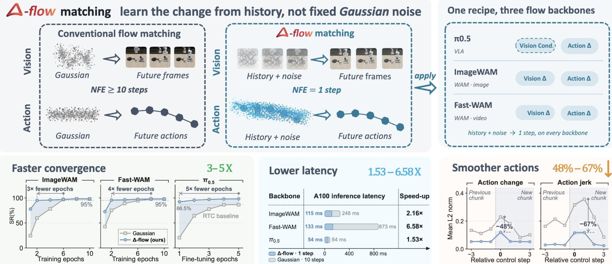

# Δ-flow Matching for Robot Foundation Models

Learn the change from history, not from fixed Gaussian noise.

[Project website](https://zuo-kuangji.github.io/delta-flow/) · [Citation](#citation)



Δ-flow starts flow matching from recent history plus mild noise and learns the residual change. The project page presents results for ImageWAM, Fast-WAM and π0.5, together with interactive illustrations of flow time and action-chunk continuity.

## Release status

- Project website and interactive illustrations: available in this repository.
- Paper and arXiv link: coming soon.
- Research implementation, training/evaluation instructions and checkpoints: coming soon.

The interactive demonstrations are illustrations; measured results are presented separately in the project page.

## Website development

The website uses plain HTML, CSS and JavaScript and needs no build step.

```bash
python3 -m http.server 8000 --directory docs
```

Open http://localhost:8000 in your browser.

## Deployment

GitHub Pages publishes `main` → `/docs`. Updates to files in `docs/` are deployed after pushing to `main`.

## Citation

The citation will be updated when the paper is published.

```bibtex
@article{zuo2026deltaflow,
  title   = {$\Delta$ Flow Matching for Robot Foundation Models},
  author  = {Zuo, Kuangji and An, Tuo and Guo, Xinying and Li, Gen and
             Zhao, Mengfei and Bai, Jiaqi and Lyu, Bofan and Yu, Zhuoyuan and
             Yang, Jinghan and Li, Jiayi and Jia, Jindou and Yang, Jianfei},
  journal = {arXiv preprint},
  year    = {2026}
}
```

MARS Lab, Nanyang Technological University.
